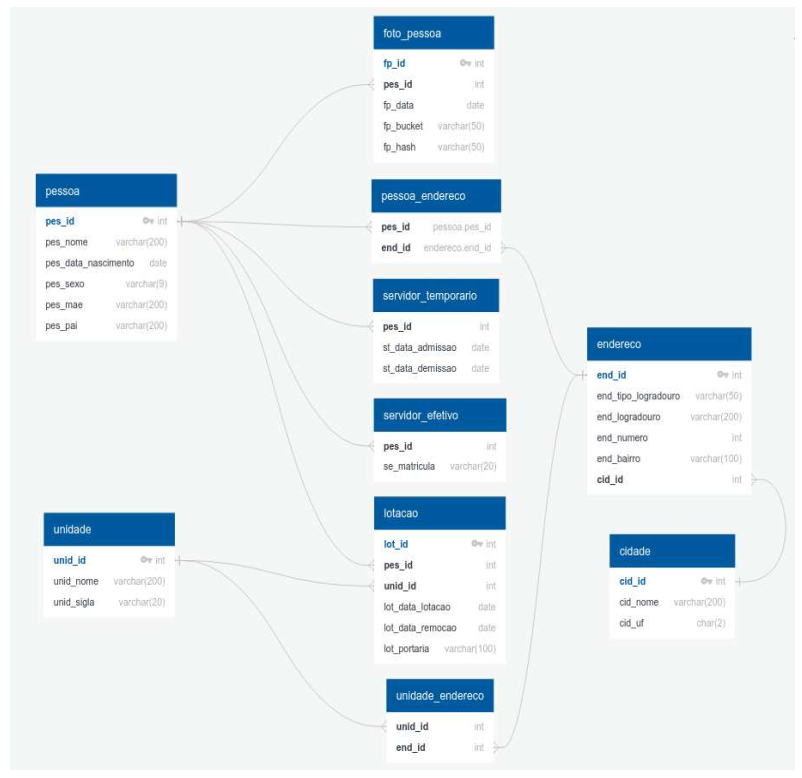

# API de Cadastro de Servidores

Este projeto implementa uma API RESTful desenvolvida com Laravel, como parte do projeto prático para a vaga de Desenvolvedor PHP prevista no edital SEPLAG/MT 002/2025. A solução tem como objetivo a gestão de pessoas e seus vínculos funcionais, abrangendo servidores temporários e efetivos, unidades organizacionais, lotações e endereços, conforme o modelo de dados fornecido.

## 👤 Dados de Inscrição

-   **Nome:** Douglas de Quadros Moura
-   **Inscrição:** 8514
-   **E-mail:** douglas@dabliotecnologia.com.br

---

## 🚀 Como executar o projeto

### Pré-requisitos

-   [Docker](https://www.docker.com/)
-   [Docker Compose](https://docs.docker.com/compose/)

### Passos para execução

1. Clone o repositório:

    ```bash
    git clone <URL_DO_REPOSITORIO>
    cd <NOME_DA_PASTA>
    ```

2. Execute o script setup.sh:

    ```bash
    chmod +x setup.sh
    ./setup.sh
    ```

3. Para visualizar as imagens armazenadas no Min.IO retornadas pela API, adicione um host local apontando para o endereço do serviço:
    ```
    #endereço host do servido no Min.IO rodando no container
    127.0.0.1 minio
    ```
4. Tudo pronto, o endpoint da API é:
    ```
    http://localhost/api
    ```

## 🧪 Testes com Insomnia

Você pode testar todos os endpoints da API utilizando a collection abaixo no [Insomnia](https://insomnia.rest/):

📥 [Download da Collection](./docs/Insomnia_2025-04-01.json)

### Como usar:

1. Baixe a collection
2. Abra o Insomnia
3. Vá em `Application` → `Import Data` → `From File`
4. Selecione o arquivo `.json` importado
5. Configure o ambiente com as variáveis:
    - `base_url`: `http://localhost/api`
    - `token`: (gerado após o login, já está incluído para teste local)

Pronto! Agora você pode testar todos os endpoints da API de forma rápida e estruturada.

---

## 📎 Observação sobre uploads de imagem

Alguns endpoints da API utilizam `multipart/form-data` para envio de imagens:

-   `POST /api/servidor-efetivo`
-   `PUT /api/servidor-efetivo/{matricula}`
-   `POST /api/servidor-temporario`
-   `PUT /api/servidor-temporario/{id}`

Nestes casos, é possível enviar múltiplas imagens pelo campo `fotos[]`, bem como remover imagens existentes via `remover_fotos[]`.

---

## 📘 Documentação dos Endpoints

A documentação completa dos endpoints da API está disponível em:

👉 [API_DOC.md](./API_DOC.md)

---

## 🗃️ Diagrama do Banco de Dados

O projeto segue o modelo abaixo para gerenciamento de entidades como `pessoa`, `unidade`, `servidor_temporario`, `servidor_efetivo`, `lotacao`, `endereco` e outras relacionadas.

> 

---

## 🛠️ Tecnologias Utilizadas

-   PHP 8+
-   Laravel 12+
-   Docker + Docker Compose
-   PostgreSQL
-   MinIO (para armazenamento de fotos)

---

## 📄 Licença

Este projeto foi desenvolvido exclusivamente como projeto prático do edital SEPLAG/MT 002/2025.
